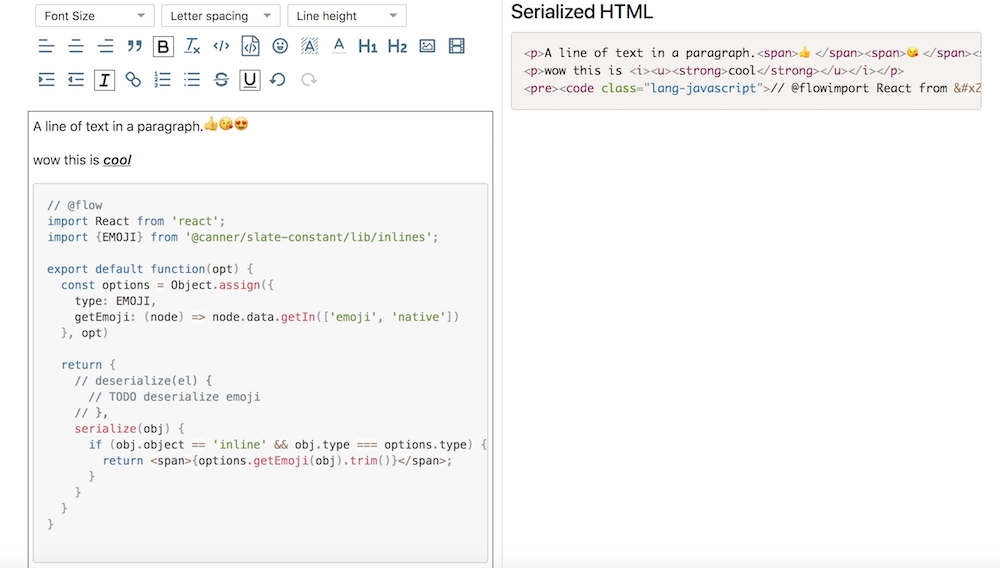

# slate-editor-icons

> Shared icons and render functions for slate editors, icons are extracted from [Quill editor](https://quilljs.com/) (see [quill-icons](https://github.com/Canner/quill-icons) for more information)

Live demo: https://canner.github.io/slate-editor-icons/

Editors that build on top of these icons:

- https://github.com/Canner/slate-toolbar
- https://github.com/Canner/canner-slate-editor

Supported features:

- [Align](./packages/slate-icon-align) - center, left, right
- [Blockquote](./packages/slate-icon-blockquote)
- [Bold](./packages/slate-icon-bold)
- [Clean](./packages/slate-icon-clean)
- [Code](./packages/slate-icon-code)
- [CodeBlock](./packages/slate-icon-codeblock)
- [Emoji](./packages/slate-icon-emoji)
- [Font background color](./packages/slate-icon-fontbgcolor)
- [Font color](./packages/slate-icon-fontcolor)
- [Header](./packages/slate-icon-header) - header 1, header 2
- [Image](./packages/slate-icon-image)
- [Indent](./packages/slate-icon-indent) - indent, outdent
- [Italic](./packages/slate-icon-italic)
- [Link](./packages/slate-icon-link)
- [List](./packages/slate-icon-list) - Ol list, Ul list
- [Strike through](./packages/slate-icon-strikethrough)
- [Underline](./packages/slate-icon-underline)
- [Undo](./packages/slate-icon-undo)
- [Video](./packages/slate-icon-video)

Supported selectors:

- [Font size](./packages/slate-select-fontsize)
- [Line height](./packages/slate-select-lineheight)
- [Letter spacing](./packages/slate-select-letterspacing)

Helpers:

- [Renderers](./packages/slate-editor-renderer)
- [Serializer and deserializer](./packages/slate-editor-html)



## Usage

This project is maintain in a monorepo, see packages in `packages` folder

Install icons that you want to support in your slate project, and pass slate editor `change (value.change())` and `onChange` function as props into the component. When users click these icons it will apply changes and trigger onChange function to update new change to your editor.

**NOTE: You have to add corresponding plugins to your editor!**

You will need to pass icon classnames as props into your components ([supported classes](https://github.com/Canner/quill-icons#props)), you could look at the example [how to setup your icon's styles](https://github.com/Canner/slate-editor-icons/blob/master/docs/style.css) 

```js
class App extends React.Component {
  // Set the initial state when the app is first constructed.
  state = {
    value: initialValue // your slate editor's initial value
  }

  render() {
    const {value} = this.state;
    const onChange = ({value}) => this.setState({value});

    return (
      <div style={{margin: '50px'}}>
        <div className="toolbar">
          {icons.map((Type, i) => {
            return <Type
              change={value.change()}
              onChange={onChange}
              key={i}
              className="toolbar-item"
              activeClassName="toolbar-item-active"
              activeStrokeClassName="ql-stroke-active"
              activeFillClassName="ql-fill-active"
              activeThinClassName="ql-thin-active"
              activeEvenClassName="ql-even-active"
            />
          })}
        </div>
        <div className="editor markdown-body">
          <Editor
            value={value}
            onChange={onChange}
            plugins={plugins} // ----> use corresponding plugins of your selected icons, for example `Bold` icon use `BoldPlugin`
          />
        </div>
      </div>
    );
  }
}
```


The best explanation is a simple example: https://github.com/Canner/slate-editor-icons/blob/master/docs/index.js

## Icon and selectors' props

All icons must passed these two props to ensure working properly.

| **props** | **type** | **required** | **default** | **description**  |
|-----------|----------|--------------|-------------|------------------|
| type     | string   | false        | each icons are different  | customized block/mark types |
| change     | object   | true        | null          | changes to value |
| onChange  | func   | true         | null         | onChange function usually `change => this.setState({value})` to update slate state  |

## Start example server

```
npm start
```

## Maintainer

[chilijung](https://github.com/chilijung)

## License

MIT © [Canner](https://github.com/Canner)


